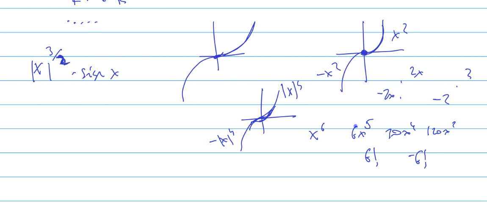
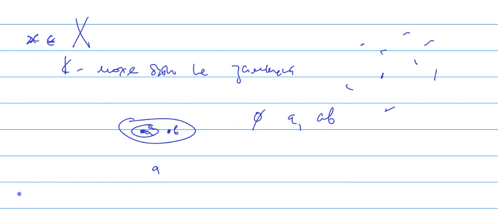
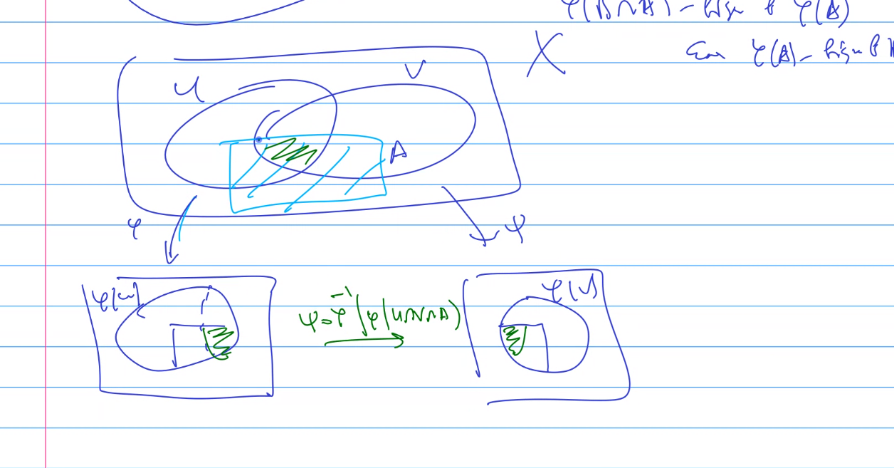
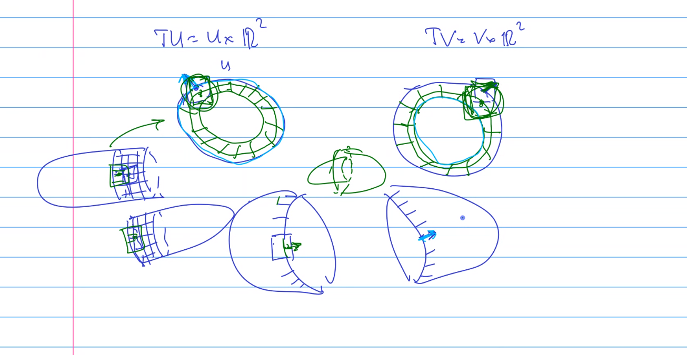

# консультація 1.10.2023

## 1.2.1
Як довести що саме C^k?

Перевірити 1.2.5

Задача 1.3 - обернена функція??

Задача 2.2
визначення локальної компактності

Якщо простір гаусдорфовий, то все прекрасно, всі визначення збігаються.  
Якщо простір гаусдорфовий, то компактність -> замкненість

Мої два визначення не випливають одне з одного

Як він видаляє в Xournal++?

---

# Notes

Задача 2.23 - дуже важлива!

# TODO
Трансверсальність  
"ключ до розуміння многовидів"
