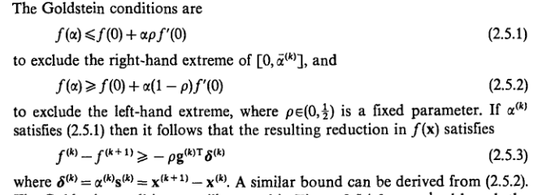
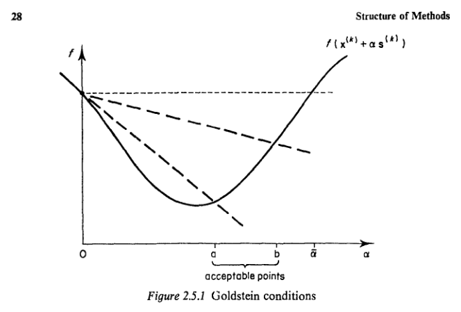
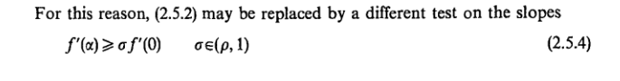
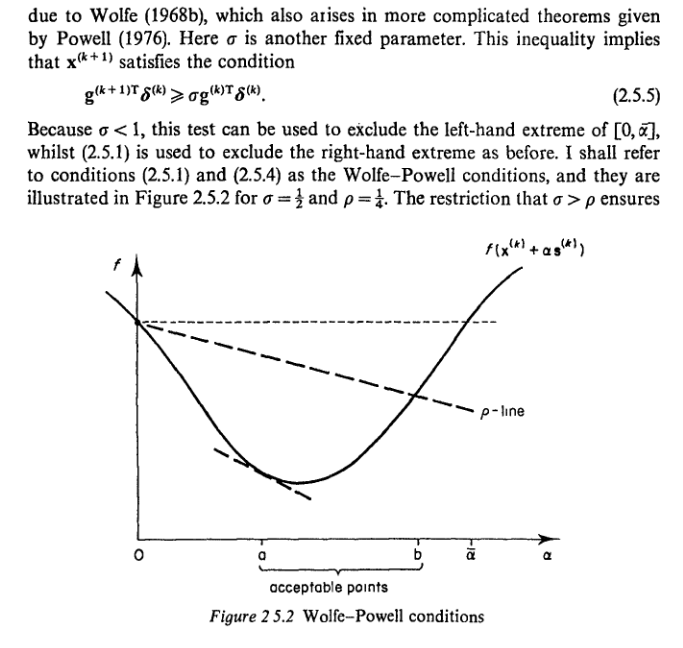
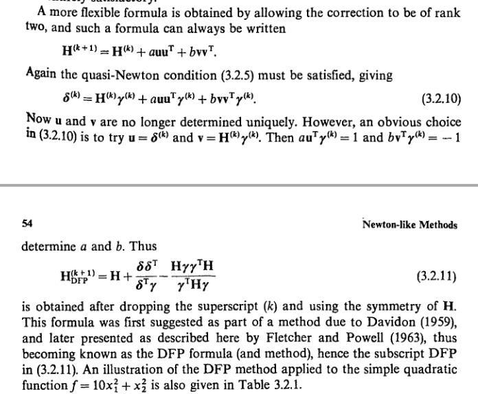
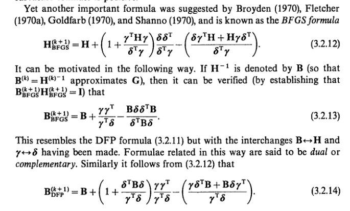
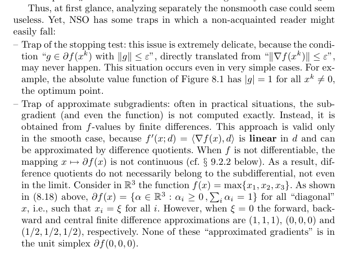
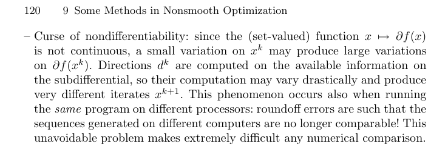

Line search descent methods have frequently been used as a means of introducing
a degree of reliability into optimization software.

The Goldstein conditions for an approximate line search  
  

The Wolfe conditions  
  
  

DFP formula  

BFGS formula  

### Common pitfalls
  

