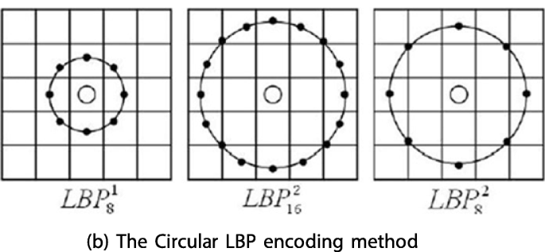
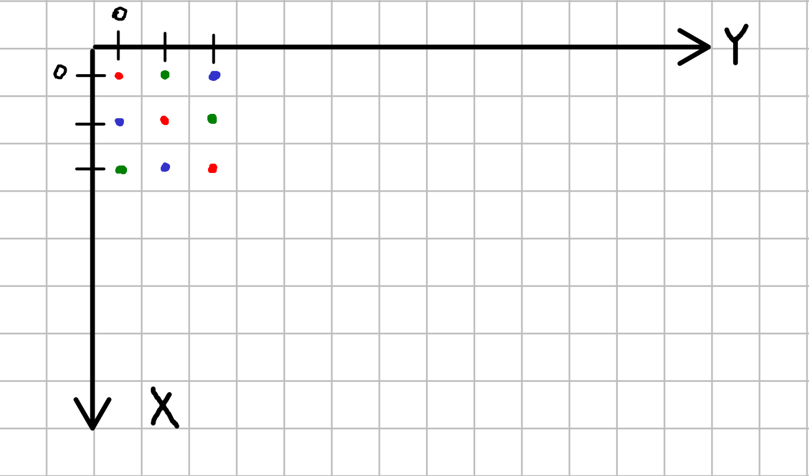

# Особливості паралельної реалізації текстурного дескриптора на основі LBP

> Під "паралельною реалізацією" мається на увазі реалізація алгоримту для паралельних обчислень; створена для роботи на багатьох процесорах одночасно.

# Текстурні дескриптори

> see also: моя презентація по текстурним дескрипторам та текстурній сегментації  
> https://drive.google.com/drive/folders/1SR85qcVcSr8gA8ZQI7GVvW_1nfTmFz1o

Текстурний дескриптор - числова чи векторна характеристика зображення, що деяким чином описує текстури, проявлені у цьому зображені. Визначення є скоріше інтуїтивним, як і визначення "текстури".

Зазвичай дескрипторами є нелінійні фільтри. Типовими прикладами текстурних дескрипторів є 
- Quantized image in frequency domain (Fourier Transform)
- Radon, Gabor filters
- GLCM
- LBP

Розглядаються такі характеристики текстур як регулярність (із певними частотами) чи іррегулярність, направленість (в певний бік) чи ненаправленість, однорідність, а також характер та направленість меж.

> see also: Erol, Berna. (2005). Handbook of Image and Video Processing || MPEG-4, H.264/AVC, and MPEG-7: New Standards for the Digital Video Industry. , (), 849–XXIV.                    doi:10.1016/B978-012119792-6/50113-3

Текстурні дескриптори можна рахувати як для всього зображення -- для визначення "усередненої" текстури на зображенні, так і для частини зображення -- для визначення різних текстур на одному великому зображенні.

У деяких випадках від текстурного дескриптора варто вимагати інваріантність відносно циклічних зсувів, поворотів, масштабування та монотонних перетворень освітленості.

Варто зазначити, що текстурні дескриптори дуже чутливі до масштабу і в роботі з ними та у подальших обчисленнях необхідно брати його до уваги. [переписати]

# Реалізація

## Вступ

### Предметна область
У нашому проєкті досліджується задача сегментації мікрофотографій біологічних тканин на основі *багаторадіального монотонного LBP дескриптора*. Гіпотеза полягає в тому, що сегменти на фотографії візрізняються саме текстурою. Текстурний дескриптор обчислюється для різних частин мікрофотографії і використовується для аналізу змін у текстурі при переході від однієї частини зображення до іншої.

Особливістю задачі є розмір вихідних зображень -- роздільна здатність від 10000x10000 (від 100 МП = 10^8 пікс.), вага у стисненому вигляді від 1 GB.

> TODO: написати статтю про LBP українською! https://en.wikipedia.org/wiki/Local_binary_patterns

### Вектор ознак LBP дескриптора 

Існує багато варіантів LBP дескрипторів, проте ми використовуємо **монотонний** [українською цього терміну ще немає] (uniform) LBP. Надалі за замовчуванням матиметься на увазі саме цей варіант.

Скалярний LBP дескриптор залежить від деяких параметрів, а саме R та P, що відповідають за масштаб (радіус) та детальність (рівень дискретизації) відповідно. 

Дескриптор приймає на вхід одноканальне зображення і повертає одне ціле число від 0 до P+1 для кожного пікселя зображення (для якого це має сенс через близкість до країв). Це число називатимемо *LBP кодом* пікселя.

LBP код пікселя обчислюється на основі порівняння його яскравості із приблизною яскравістю зображення у P точках, рівномірно розміщених по колу радіуса R навколо цього пікселя.
При цьому яскравість точки зазвичай обчислюється білінійною інтерполяцією між чотирма найближчими до неї пікселями. Тут і далі мається на увазі Евклідова відстань. 

Важливо, що дескриптор у більшості випадків не приймає до уваги пікселі ближче ніж R-1, далі ніж R+1, а також пікселі на колі радіуса R, що потрапили *між* тестовими точками. Таким чином, ми маємо очікувати, що дескриптор "пропускає" деякі властивості зображення. Повнота опису дескриптора частково регулюється рівнем дискретизації P.
Варто зауважити, що в загальному випадку зі збільшенням радіусу дескриптора також необхідно збільшити і рівень дискретизації.



Після обчислення усіх LBP кодів, будується гістограма частот цих LBP кодів у зображенні. Програмно гістограмна представляється у вигляді невід'ємного цілочисленого вектора довжини P+2. Цей вектор, а одночасно і гістограму, називатимемо *вектором ознак* зображення.
Зауважимо, що сума координат вектора ознак стала і дорівнює кількості пікселів у зображенні.


### Багаторадіальний LBP дескриптор

У попередньому розділі параметри LBP були сталі, що відповідає певному масштабу (параметр R) та певному рівню дискретизації (параметр P). На практиці дуже складно визначити оптимальний масштаб текстурного дескриптора для зображення, отож у нашому алгоритмі використовується комбінація значень дескрипторів одразу для багатьох значень параметра R та P. 
У нашому випадку використовується емпірична формула, що однозначно визначає P за R.  

> [можна тут додати математичне формулювання та визначення R_i P_i]

Після обчислення векторів ознак для кожного значення R (та відповідного йому P), вони конкатенуються в один великий вектор, який і буде значенням багаторадіального LBP дескриптора.

Обраний нами скалярний текстурний дескриптор (uniform LBP, монотонний локальний бінарний шаблон) теоретично є інваріантним відносно поворотів зображення та монотонних перетворень яскравості.

Надалі вважатимемо еталонною реалізацією скалярного монотонного LBP дескриптора функцію [skimage.feature.local_binary_pattern](https://scikit-image.org/docs/stable/api/skimage.feature.html#skimage.feature.local_binary_pattern) в бібліотеці scikit-image для Python із параметром `method='uniform'`.
Частина алгоритму реалізована мовою Cython, що буде важливо у наступних частинах.

### Дескриптор як частина алгоритму сегментації
Типовий алгоритм сегментації очікує на вхід зображення та параметри, і дає на виході результат сегментації зображення у вигляді матриці передбачених класів для кожного пікселя.

> [додати сюди математичне формулювання із індексами]

Наш загальний алгоритм має наступний вигляд:
- Зображення розбивається на багато однакових частин (патчів, клаптиків)
- Обчислюється значення текстурного дескриптору (вектор ознак) для кожного клаптика незалежно від інших
- Отримана тривимірна матриця ознак передається алгоритму кластеризації, що повертає матрицю передбачених класів для кожного клаптика
- Матриця класів для клаптиків очевидним чином розгортається у матрицю класів для пікселів

### Мета проєкту
Реалізувати паралельний алгоритм обчислення багаторадіального монотонного LBP дескриптора для текстурної сегментації, адаптовану для роботи на великих зображеннях, на онові реалізації scikit-image.
Реалізація має працювати не повільніше за базову реалізацію на основі scikit-image.

Наша гіпотеза полягає в тому, що паралельна реалізація дасть можливість швидше обчислити дескриптор LBP у багатопроцесорних середовищах.

## Способи оцінки реалізації та метрики швидкодії

### Час виконання та прискорення

1. Відносно базової реалізації на scikit-learn
2. Із різними значеннями `[R]`, розмірами зображень та кількістю паралельних процесів
3. Відносно однопроцессорного режиму 

### Ефективність використання процесорів

1. Як speedup / ncpus
2. Вручну через журнал виконання
3. 

### Використання пам'яті
> TODO: взагалі поки не розумію що тут можна написати, але точно можна знайти

## Проєктування алгоримту

### Технічні особливості

Позначимо $\mathbb Z[a,b] := \mathbb Z \cap [a,b]$.

Відображення $ I \colon \mathbb Z[0,N-1] \times \mathbb Z[0,M-1] \longrightarrow \left(\mathbb Z[0,255]\right)^n$
називатимемо $n$-канальним **растровим зображенням** розміром $N \times M$ пікселів.

Стандартні кольорові зображення, в тому числі мікрофотографії біологічних тканин, мають $n\in\{3,4\}$ та практично не мають обмежень на розміри. 

Прийнято орієнтуватися по двовимірному простору координат зображення так, що перша координатна вісь (x) відповідає напрямку верх-низ, а друга (y) -- напрямку ліво-право, при чому точка $(0,0)$ знаходиться у верхньому лівому куті.




#### Білінійна інтерполяція зображення
Оскільки растрові зображення визначаються у скінченній кількості точок (пікселів), а LBP оперуватиме дробовими координтами, введемо процедуру доповнення растрового зображення 
$$ I \colon \mathbb Z[0,N-1] \times \mathbb Z[0,M-1] \longrightarrow \mathbb Z[0,256]$$
до неперервного
$$ \hat I \colon [0,N-1] \times \mathbb [0,M-1] \longrightarrow [0,256]$$ 
шляхом білінійної інтерполяції.

```
function bilinear_interp(I, x, y):
    r0 = floor(x)
    c0 = floor(y)
    r1 = ceil(x)
    c1 = ceil(y)
    dx = x - r0
    dy = y - c0
    top = (1 - dy) * I(r0,c0) + dy * I(r0,c1)
    bottom = (1 - dy) * I(r1,c0) + dy * I(r1,c1)
    v = (1 - dx) * top + dx * bottom
    return v
```

Або математично  
$r_0 = \lfloor x \rfloor$, $r_1 = \lceil x \rceil$,  
$c_0 = \lfloor y \rfloor$, $c_1 = \lceil y \rceil$,  
$dx = x - r_0$, $dy = y - c_0$,  
$top = (1 - dy) \cdot I(r_0,c_0) + dy \cdot I(r_0,c_1)$,  
$bottom = (1 - dy) \cdot I(r_1,c_0) + dy \cdot I(r_1,c_1)$,  
$\hat I(x,y) := (1 - dx) \cdot top + dx \cdot bottom$  

$$\begin{align*}\hat I(x,y) := (1 - dx) &\cdot \left((1 - dy) \cdot I(r_0,c_0) + dy \cdot I(r_0,c_1)\right) + \\ + \; dx &\cdot \left( (1 - dy) \cdot I(r_1,c_0) + dy \cdot I(r_1,c_1) \right)\end{align*}$$

$$\begin{align*}\hat I(x,y) := \; (1 - dx)(1 - dy)&I(r_0,c_0) &+& \; (1-dx) \cdot dy\cdot I(r_0,c_1) + \\ + \;dx \cdot (1-dy) &I(r_1,c_0) &+&\; dx \cdot dy \cdot I(r_1,c_1)\end{align*}$$

При цьому для $(n,m) \in \mathbb Z^2$ маємо $r_0=r_1=n$, $c_0=c_1=m$, $dx=dy=0$, та 
$$\hat I(n,m) = I(n,m) \quad \forall (n,m) \in \mathbb Z^2$$


Note: 
$$\hat I(x,y) = \begin{pmatrix}1-dy & dy\end{pmatrix} \cdot \begin{pmatrix}I(r_0,c_0) & I(r_1,c_0) \\ I(r_0,c_1) & I(r_1,c_1)\end{pmatrix} \cdot \begin{pmatrix}1-dx \\ dx\end{pmatrix}$$

### Псевдокод деяких частовикористовуваних функцій
Вважаємо, що тут і далі всі вхідні дані алгоритмів за замовчуванням мають коректні значення, якщо не зазначено інакше. 


### Алгоритм обчислення LBP коду одного пікселя
```
In: image I(i,j), integer r, integer c.
Params: float R, integer P.
Out: integer C.

function calc_lbp_code(I, r, c, R, P):
    float points[P]       // float array of length P
    for k from 0 to P-1:
        x = r + R*cos(k*2pi/P)
        y = c + R*sin(k*2pi/P)
        points[i] = bilinear_interp(I, x, y)
    return lbp(I(r,c), points)
```

Де функція `lbp` це специфічна для текстурного дескриптора LBP функція із значеннями від 0 до P+1 включно та алгоритмічною складністю $\mathcal O (P)$. Але в цій роботі вважатимемо час виконання цієї функції несуттєво малим.

### Базовий послідовний алгоритм

Нехай одноканальне растрове зображення вже розбито на клаптики, кожен розміром $U \times V$ пікселів.
Кожен клаптик сам по собі є одноканальнм растровим зображенням. Позначимо i-й згори j-й зліва клаптик у псевдокоді через `chunk[i,j]`. Тобто, $\text{chunk}_{ij}(u,v) \in \mathbb Z[0,255]$, де $(u,v) \in \mathbb Z[0,U-1] \times \mathbb Z[0,V-1]$.

```
// (i,j) - індекс клаптика
// (u,v) - координати пікселя всередині клаптика
// (r,c) - координати пікселя у загальному зображенні
// r(u), c(v) це координати пікселя з клаптика у загальному зображенні
// R це параметр LBP, значення з масиву заданих радіусів
// D це остаточна розмірність вектору ознак, D = sum(P1+2, P2+2, ..., Pn+2)

var all_features[N/U-1, M/V-1]     // тривимірний масив векторів ознак для кожного клаптика

for (i,j):                         // для всіх допустимих індексів клаптиків
    integer feature_vector[]       // вектор ознак поточного клаптика
    
    for R:                         // для всіх заданих параметрів R
        P = P(R)                   // в цій роботі розглядаємо P залежне від R
        integer lbp_codes[U,V]     // двовимірний масив LBP кодів для кожного пікселя клаптика
        
        for (u,v):                 // для кожного пікселя у клаптику
            // обчислити lbp код пікселя, враховуючи оточуючі пікселі із сусідніх клаптиків
            lbp_codes[u,v] = calc_lbp_code(I, r(u), c(v), R, P)
        
        histogram = calc_histogram(lbp_codes)    // вектор довжини P+2
        
        // додаємо цей вектор у кінець загального вектора ознак
        feature_vector := concat(feature_vector, histogram)  
    
    all_features[i,j] = feature_vector
return all_features
```


### Підхід до паралелізації

У **Базовий послідовний алгоритм** можна побачити декілька місць із так званими [приголомшливо паралелельними обчисленнями](https://uk.wikipedia.org/wiki/%D0%9F%D1%80%D0%B8%D0%B3%D0%BE%D0%BB%D0%BE%D0%BC%D1%88%D0%BB%D0%B8%D0%B2%D0%B0_%D0%BF%D0%B0%D1%80%D0%B0%D0%BB%D0%B5%D0%BB%D1%8C%D0%BD%D1%96%D1%81%D1%82%D1%8C) ([embarrassingly parallel workload](https://en.wikipedia.org/wiki/Embarrassingly_parallel)).

По-перше, обчислення вектору ознак для одного значення параметрів (R,P) не залежить від обчислення для іншого значення параметрів. По-друге, обчислення вектору ознак для одного клаптика не залежить від обчислень для іншого клаптика. Таким чином маємо декілька варіантів паралелізації:

1. `Job(R, P(R))`
2. `Job(i, j)`
3. `Job(R, P(R), i, j)`

Проаналізуємо кожен з них з точки зору часу виконання

> [TODO аналіз алгоритмів]

...
...

Таким чином, з погляду 

---

